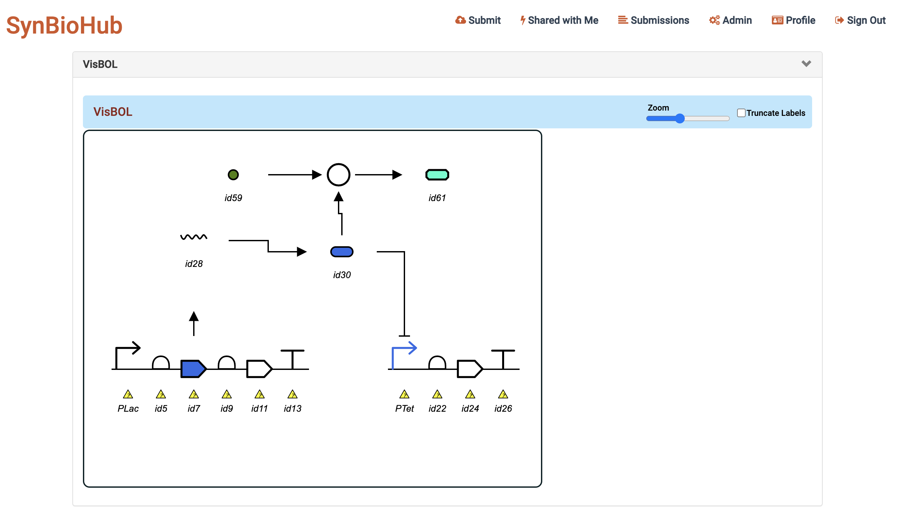
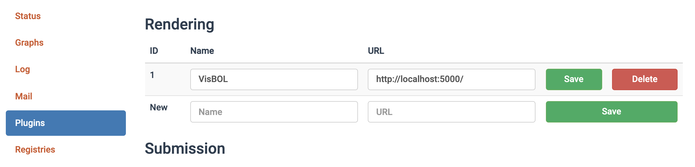

Welcome the the VisBOL 2.1 plugin!

# Project Description

VisBOL 2.1 is a visualization plugin engine for SynBioHub that allows SBOLCanvas designs to be visualized directly on SynBioHub. It also uses the "visbol" and "visbol-react" packages to create visualizations for standard SBOL files.

# Interface

# Local Installation

Follow the instructions on the [GitHub README](https://github.com/SynBioHub/synbiohub#manual-installation) to install SynBioHub locally on your system and start the SynBioHub process. In the Admin module, configure the plugin as follows:

1. Clone the VisBOL2.1 Plugin repository `git clone https://github.com/SynBioHub/Plugin-Visual-VisBOL.git`
2. Change to the VisBOL2.1 Plugin directory `cd sequence-view-plugin`
3. Install all the dependencies `yarn install`
4. Build the repository `yarn run build`

If you're using the plugin on your local SynBioHub, run `yarn run local`. It assumes your local SynBioHub is on port 7777 (see line 46 of localserver.js).

If you're not planning to use the plugin on a local SynBioHub, you will be using server.js. You can run it using `yarn run start`. This should be configured to work if used on the official SynBioHub. See the Publish section below.

# Publish

Releases are published automatically to DockerHub using GitHub Actions. There is an action which fires when the github repository is pushed to. It publishes an image to Docker Hub as synbiohub/plugin-visual-visbol, which will eventually be used in public SynBioHub. It should be noticed that docker use server.js to start the server.